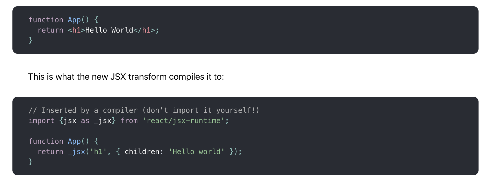
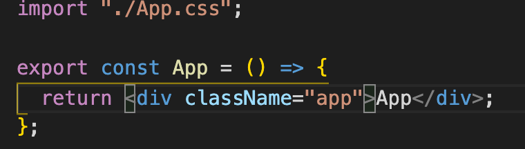
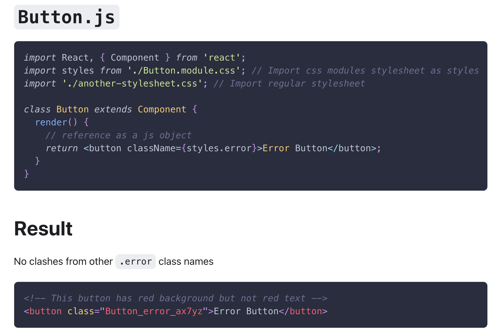
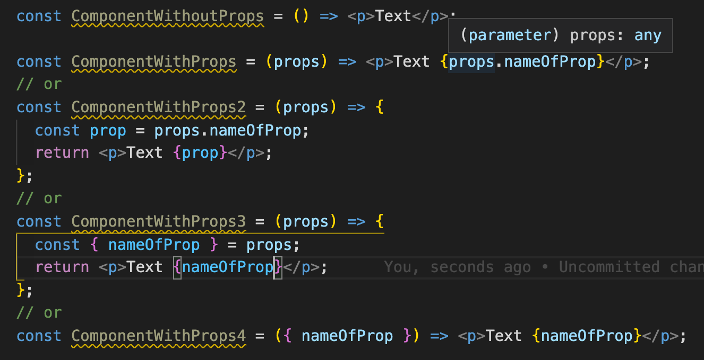
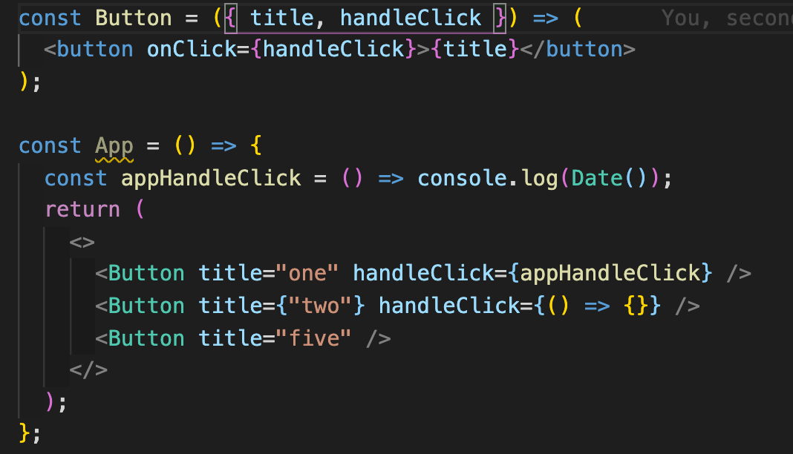

### JSX

https://ru.reactjs.org/docs/introducing-jsx.html
https://ru.reactjs.org/docs/jsx-in-depth.html

### CSS

##### Simple

##### Module

[CRA realization](https://create-react-app.dev/docs/adding-a-css-modules-stylesheet/)

### Элементы

`const element = <h1>Hello, world</h1>;`

https://ru.reactjs.org/docs/rendering-elements.html

### Props

https://ru.reactjs.org/docs/components-and-props.html

Get props

Set props

### State

https://ru.reactjs.org/docs/hooks-state.html

### Events

like onClick  
https://ru.reactjs.org/docs/handling-events.html

### Notes

- for fix all errors
  yarn eslint ./src --ext .jsx --fix

- <> </> react fragment

- valid values for jsx - true/false, null/undefined, string, number, JSX.Element, React.Component, arrays of all this guys

- for vscode eslint autofix (add it to json view of settings)
  "editor.codeActionsOnSave": {
  "source.fixAll.eslint": true
  },

- advice - install this shell - `zsh` and this for it customization `oh-my-zsh`
